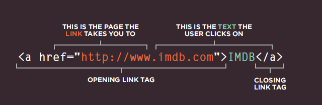

# Writing Links

##### Links are created using the <a> element. Users can click on anything between the opening <a> tag and the closing </a> tag. we specify which page we want to link to using the href attribute.

Links are created using the <a> element.
- The <a> element uses the href attribute to indicate the page we are linking to.
- If we are linking to a page within your own site, it is best to use relative links rather than qualified URLs.
- we can create links to open email programs with an email address in the "to" field.
- we can use the id attribute to target elements within a page that can be linked to.

# Layout

##### 
 elements are often used as containing elements to group together sections of a page. Browsers display pages in normal flow unless we specify relative, absolute, or fixed positioning.

##### The float property moves content to the left or right of the page and can be used to create multi-column layouts. (Floated items require a defined width.) 

##### Pages can be fixed width or liquid (stretchy) layouts. Designers keep pages within 960-1000 pixels wide, and indicate what the site is about within the top 600 pixels (to demonstrate its relevance without scrolling).

##### Grids help create professional and flexible designs. CSS Frameworks provide rules for common tasks. we can include multiple CSS files in one page.