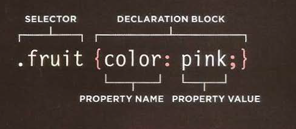
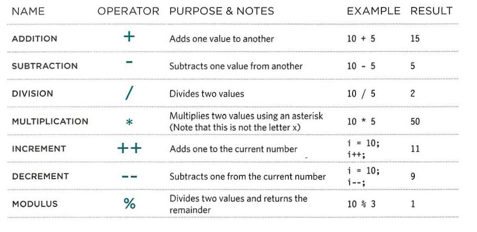
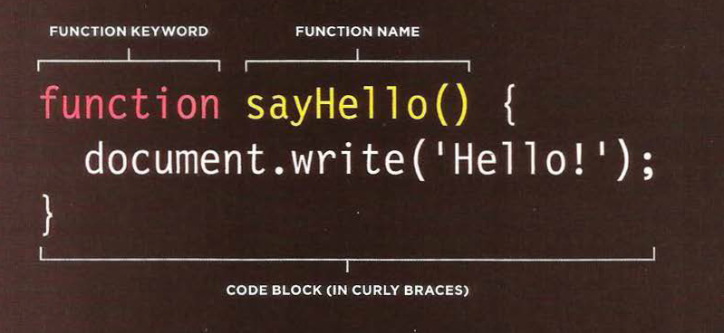
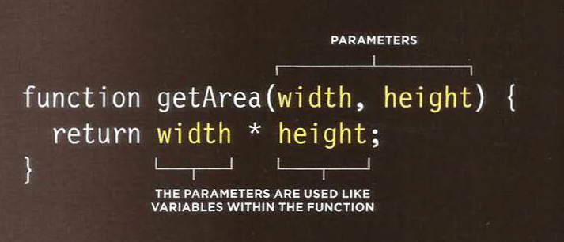

# INTRODUCTION: HTML and CSS Refresher

#### HTML element: html elements are added to the content of the page to describe its structure.An element contains:
- the opening and cloassing tags <>.....</>.
- Attribute name.
- attribute value.

#### CSS Rules: css uses Rules to indicate how the content of one or more element should be displayed in the web page.

##### each rule has a selector which element is used to apply the rule on it, and declearation blocks contain the rule that indicate how the element will appear in the web page.

#### EXPRESSIONS: An expression evaluates into (results in) a single value. Broadly speaking there are two types of expressions.

#### OPERATORS: Expressions rely on things called operators; they allow programmers to create a single value from one or more values.

#### ARITHMETIC OPERATORS: JavaScript contains the following mathematical operators, which you can use with numbers.You may remember some from math class.

#### STRING OPERATOR: There is just one string operator: the+ symbol.It is used to join the strings on either side of it.

#### WHAT IS A FUNCTION?

##### Functions let you group a series of statements together to perform a specific task. If different parts of a script repeat the same task, you can reuse the function (rather than repeating the same set of st atements).

##### to declar a function we give it a name and then we write the statments nedded to achive its task inside a curly braces.

##### the next step is calling the function in the code with its name to excute all the statements inside it.

#### somtimes functions need information to perform its task.

#### the values of this information are called arguments and they can be variable or numbers or string values...etc.

#### some function return information to the code that called it , for example return result of some calculation inside the function.

