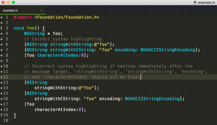

# text editor:
##### it is a piece of software that downloaded and installed on computers, or  online through your web browser, which make us write and manage text, such as the text that we write to create a web site. which is one of the most important tools that we can use as an aspiring web developer.

##### why text editor is important for software developers: there are more than one features that we should look for in a text editor, for example:

- **code completion :** 
##### which allows to start typing, and display possible suggestions based on what you originally typed. ***This saves you time by providing a choice, rather than allowing you to finish typing and possibly encounter typos.***

##### Also, some code completion includes the closing of tags, the closing of brackets and the closing of quotation marks when we open them, ***thus making sure you’re always writing your codewhich improve our ability to write our HTML and CSS more efficiently.*** 

- **syntax highlighting :**
##### it takes the text you type, and makes it more noticeable by colorizing the text. Attributes are a different color than elements. And elements are a different color than copy. *** This makes it so much easier when we’re looking for an error and we can’t find it. As well as making our text easier to read.***

- **a nice variety of themes:**
These themes will allow us to change the color of the background of your text editor, the series of colors in your text, and sometimes themes will affect other aspects of our text editing software as well. ***which reduce eye strain and fatigue.***

- **the ability to choose from a healthy selection of extensions available when you need them.** 

# text editor classifications: 

##### Every computer will come with its own text editor: 

- On Mac computers, the text editor that comes with  computers is called, **Text Edit**.
- On Windows computers, the text editor that comes with
computers is called, **Notepad**.

- And on Linux computers, each distribution will have its own text editor already installed,These text editors will go by different names. One distro might have **Gedit** and others might have other titles. 

- text editors downloaded and installed to computers from their respective websites. like:
   - Notepad++.
  - Text Wrangler
  - BB Edit
  - Visual Studio Code
  - Atom
  - Brackets
  - Sublime Text.

# introduction: using terminal

## The Command Line: 
##### A command line, or terminal, is a text based interface to the system. entering commands by typing them on the keyboard and then a feedback will be given similarly as text.

# Basic Navigation: 
##### In this section, we'll learn the basics of moving around the system. Many tasks rely on being able to get to, or reference the correct location in the system. As such, this stuff really forms the foundation of being able to work effectively in Linux. 

- pwd: Print Working Directory ie,Where are we currently.
- ls: List the contents of a directory.
- cd: Change Directories - ie. move to another directory.

# important concepts:

- Relative path: A file or directory location relative to where we currently are in the file system. 
- Absolute path: A file or directory location in relation to the root of the file system.

# More About Files:

#####  the first thing we need to appreciate with linux is that under the hood, everything is actually a file. A text file is a file, a directory is a file, your keyboard is a file (one that the system reads from only), your monitor is a file (one that the system writes to only) etc. To begin with, this won't affect what we do too much but keep it in mind as it helps with understanding the behaviour of Linux as we manage files and directories.
##### This one can sometimes be hard to get your head around but as you work through the sections it will start to make more sense. A file extension is normally a set of 2 - 4 characters after a full stop at the end of a file, which denotes what type of file it is. The following are common extensions:

- file.exe - an executable file, or program.
- file.txt - a plain text file.
- file.png, file.gif, file.jpg - an image.

##### In other systems such as Windows the extension is important and the system uses it to determine what type of file it is. Under Linux the system actually ignores the extension and looks inside the file to determine what type of file it is. As such it can sometimes be hard to know for certain what type of file a particular file is. Luckily there is a command called file which we can use to find this out.

file [path]
